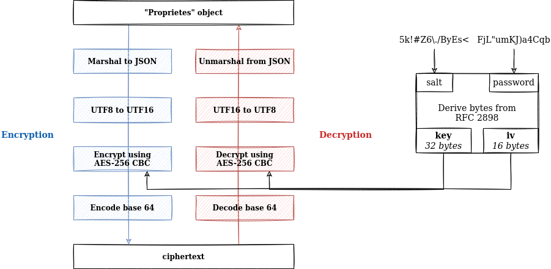

# License LVL 2

Après le niveau 1, le système de chiffrement a été renforcé : désormais, nous avons un AES en CBC dérivant la clé et l'iv dérivé d'une byte pool selon la RFC 2898. Puisque c'est de la cryptographie par bloc (de taille constante), il faudra nous méfier du padding PKCS lors du (dé)chiffrement.

On omet dans ce WU la partie nous amenant à comprendre comment fonctionne le système, puisqu'il est le même que pour le niveau 1. S'y référer si besoin.

## Analyse du mécanisme de déchiffrement

En nous basant sur le niveau 1, on analyse le fonctionnement du système de déchiffrement dans `cryptageapi/cryptapi.go` :
 - on décode d'une base 64
 - on déchiffre en AES CBC et on retire un éventuel padding
 - on passe d'un UTF-16 à UTF-8

Le contenu JSON sera alors unmarshal dans un objet `*Proprietes`, et si le `ModeApplication` est standard, on valide le challenge.

## Inversion du processus

Le processus décrit ci-dessus fait appel à de la cryptographie symétrique (AES CBC) et est inversible.
Pour construire une license, nous devons :
 - créer un objet avec les paramètres désirés
 - le marshal JSON
 - passer d'UTF-8 à UTF-16
 - ajouter un éventuel padding et chiffrer en AES CBC
 - encoder base 64

Toutefois, une petite étape supplémentaire sera nécessaire : pour AES, nous avons besoin d'une clé de chiffrement `key` et d'un vecteur d'initialisation `iv`.
Ceux-ci sont dérivés d'une byte pool défini par la RFC 2898.
Nous devons donc reproduire ce mécanisme pour générer les deux variables.

<div align="center">
    
</div>

## Émission d'une license en mode standard

On peut écrire le code suivant pour nous chiffrer une license à partir de son JSON.
```go
func CryptageAPIEncrypt(b []byte) ([]byte, error) {
    // UTF-8 to UTF-16 conversion
	b = double(b)

    // PKCS padding
	r := 16 - len(b)%16
	if r == 16 {
		r = 0
	}
	b = append(b, bytes.Repeat([]byte{byte(r)}, r)...)

    // AES CBC encryption
	block, err := aes.NewCipher(cryptageapi.K)
	if err != nil {
		return nil, err
	}
	mode := cipher.NewCBCEncrypter(block, cryptageapi.IV)
	mode.CryptBlocks(b, b)

    // Base 64 encoding
	out := make([]byte, base64.StdEncoding.EncodedLen(len(b)))
	base64.StdEncoding.Encode(out, b)

	return out, nil
}

func double(b []byte) []byte {
	lb := len(b)
	out := make([]byte, lb*2)
	for i := 0; i < lb*2; i += 2 {
		out[i] = b[i/2]
		out[i+1] = '\x00'
	}
	return out
}
```

Nous pouvons par exemple émettre une license dont le JSON correspond à `{"ModeApplication":"standard","InitDay":"2023-04-13T02:00:00","NombreSatellites":5,"NombreBases":32,"NombreUtilisateurs":12,"NombreBatteries":8}`, qui une fois chiffrée vaudra `cOJKdQgJ5Xqc/wwYhXSkCp8tMu6qGXo2KZcLv7R3XxbSJPpzLKVjmSPPBYLKxGJ7Sia34b6J2faYVye0af46DFYu/ljwRQVhU4hzHcEaDMNT6RGm5v3au8N3kyUlaPsBBfrx/ac8RpcOl55XocE2yktPyP9+4L7MTL2ZTEnOJ/vqHnn0fGKcyLD3624tDDohq7VIARhiknyNIuk9vqLjofGeP/hXuiB2Z9+5BDXD0Z/l1xC1pySC/ctej7qa3Mv3ODfEE6H8GGzlzrfzR0Bks2b9Qm/T5Z3RbOdzu2tD1ehIDMPlAYr/78yyEcC/eSDSAjEUyW1ppkdzBKG2AKR2SsjHBJbpaW73Qy1W5UJJ491ts/wOsZjafFaaaD3mnjl9`.

On peut alors la soumettre et récupérer le flag via la requête suivante.
```bash
curl -s http://license-lvl2:8080/license -d '{"raw":"cOJKdQgJ5Xqc/wwYhXSkCp8tMu6qGXo2KZcLv7R3XxbSJPpzLKVjmSPPBYLKxGJ7Sia34b6J2faYVye0af46DFYu/ljwRQVhU4hzHcEaDMNT6RGm5v3au8N3kyUlaPsBBfrx/ac8RpcOl55XocE2yktPyP9+4L7MTL2ZTEnOJ/vqHnn0fGKcyLD3624tDDohq7VIARhiknyNIuk9vqLjofGeP/hXuiB2Z9+5BDXD0Z/l1xC1pySC/ctej7qa3Mv3ODfEE6H8GGzlzrfzR0Bks2b9Qm/T5Z3RbOdzu2tD1ehIDMPlAYr/78yyEcC/eSDSAjEUyW1ppkdzBKG2AKR2SsjHBJbpaW73Qy1W5UJJ491ts/wOsZjafFaaaD3mnjl9"}' \
    | jq -r ".flag"
```

On obtient le flag `24HIUT{sYm3tric_c#yp7o_&_sym€tric_pr*ces5}`.
