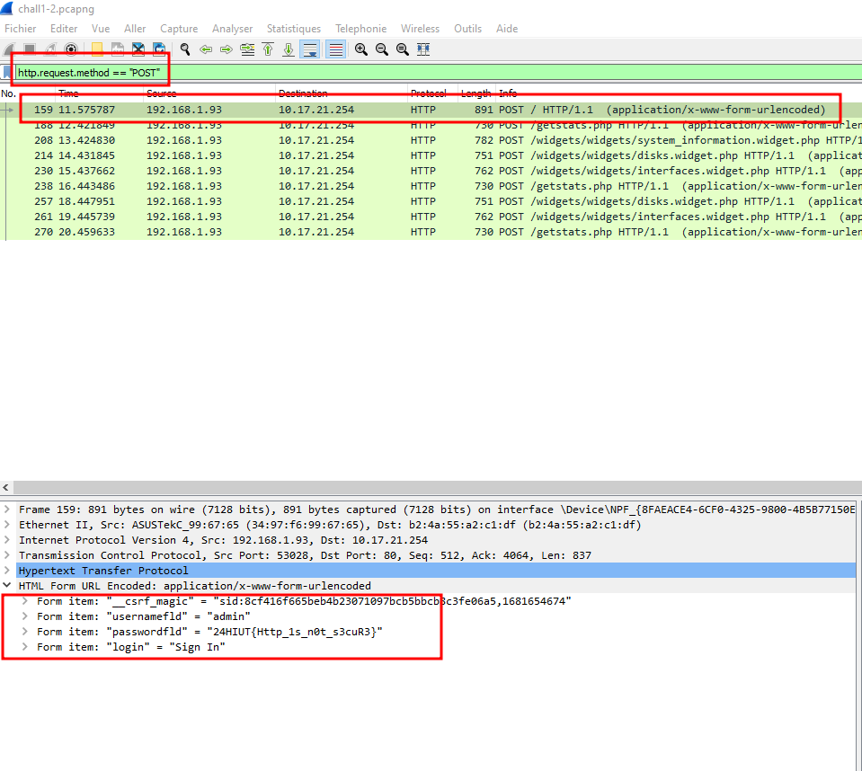

# Challenge 1 : HTTP Authentication

Contexte :
Oh non ! Je n'avais pas vu que ma connexion n'était pas chiffée ! 
J'espère que personne ne m'espionnait...

# Step 1 : Retrouver l'ip du serveur web
Ajouter le filtre `http` pour n'afficher que les flux HTTP (non chiffré) et suivre l'échange de données/

# Step 2 : Retrouver la requête POST d'authentification
Ajouter le filtre `http.request.method==POST` pour n'afficher que les requêtes POST. Enfin, trouver la bonne requête pour retrouver le flag.
