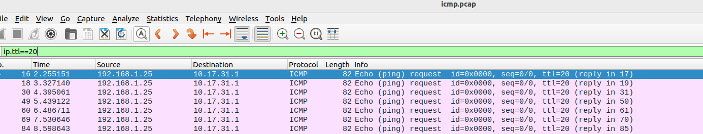
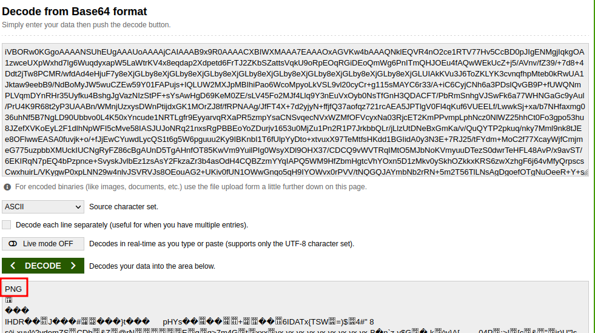
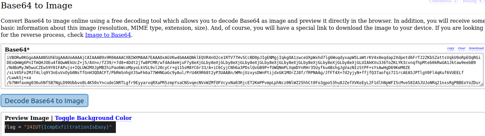

# Challenge 2 : ICMP Exfiltration

Contexte : Nous avons remarqué des échanges curieux avec le serveur dash.pasfastoche.lan.
Il semblerait que de nombreuses requêtes ping soient envoyées par là-bas. Trouvez ce qu'il s'y trame..

Hint : Les trames intéressantes possède un ttl modifié.

=> Les trames modifiées ont un ttl à 20.  Pour filtrer ceci avec wireshark, ip.ttl==20 pour passer à la Step-2.

## Step 1 : Retrouver les trames intéressantes 
Il faut tout d'abord retrouver l'IP de la machine distante : `dns.qry.name=="dash.pasfastoche.lan"`, nous retrouvons `10.17.31.1`, on va pouvoir s'en servir pour filtrer un peu plus avec `ip.addr==10.13.31.1`. 
Parmi toutes les trames envoyées, seules les trames ICMP à destination de la machine 10.17.31.254 nous intéressent.
Seulement, il faut aussi faire attention, seules celles avec un TTL à 20 sont vraiment intéressantes ^:)



## Step 2 : Se rendre compte de ce qui est **vraiment** intéressant
Maintenant qu'on a les bonnes trames, il faut également se rendre compte que le champ data est modifié et ce qui est envoyé est en base64.
On peut voir que la dernière trame se termine par '==', c'est caractéristique d'un base64.

## Step 3 : Reconstruire le base64
Ecrire un script permettant de reconstruire le base64 en entier, par exemple : 

```
from scapy.all import *

pcap_flow = rdpcap('icmp.pcap')

solv = list()
for packet in pcap_flow:
    
    if 'ICMP' in packet and packet.ttl == 20: 
        payload = packet[ICMP].payload
        solv.append(payload.load.decode("utf-8"))


print("Base64 : ", end = '')
print(''.join(solv))

```

## Step 4 : Retrouver l'information utile
Premier reflexe : https://base64decode.org



Intéressant : On observe qu'il s'agit d'une image PNG ! 

Deuxième reflexe : google : base64 to PNG 


Bingo ! 

